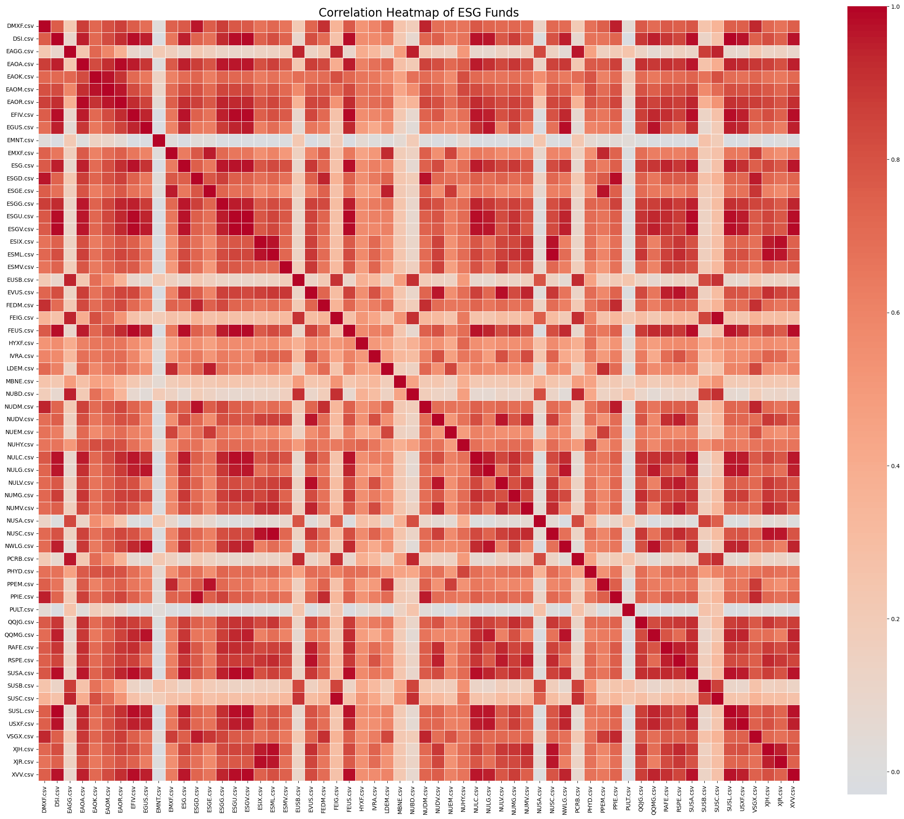
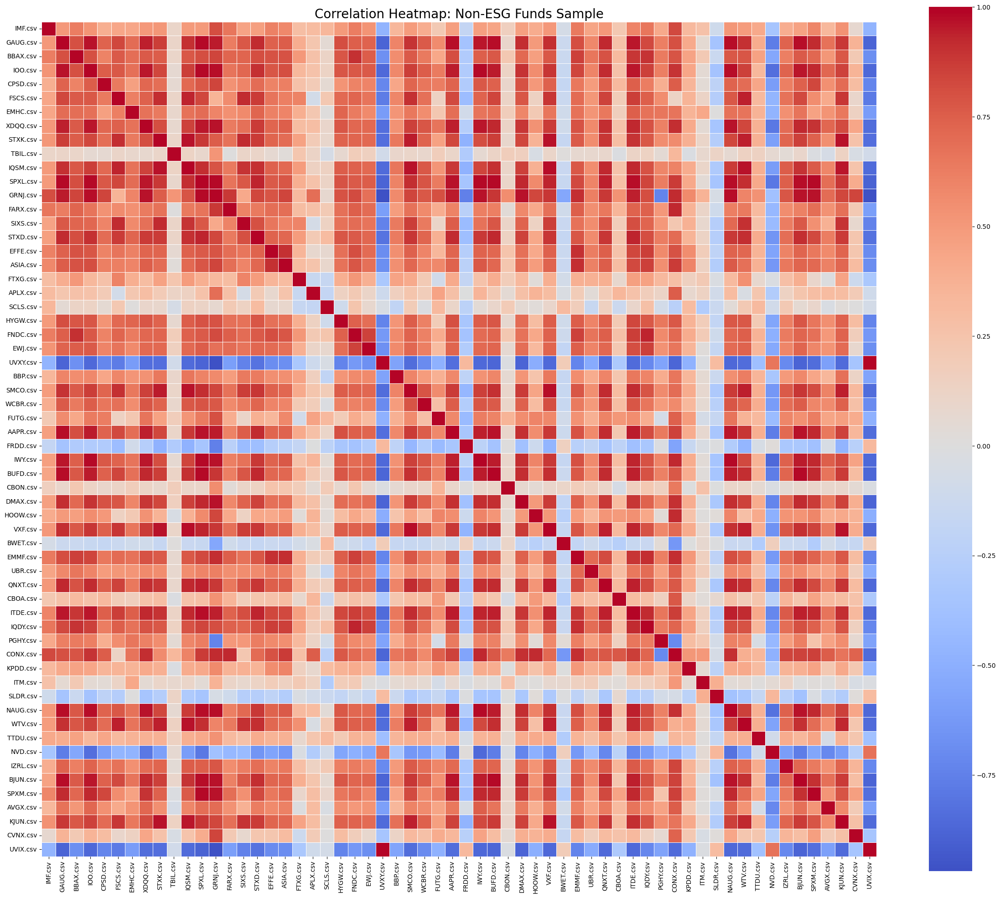

# Paying for Clones: The Homogeneity Tax on ESG

If you buy ten different "Green" ETFs, are you actually diversifying your capital, or are you just paying ten different expense ratios for the exact same ride? We ran a correlation analysis to see if the ESG landscape is a vibrant ecosystem of different strategies or just a crowded trade of copycats. The heatmaps below act as our lie detector.

### The "Sea of Red" Problem

**The Stats:**

  * **ESG Mean Correlation:** 0.576
  * **Non-ESG Mean Correlation:** 0.370

The difference is stark. Our ESG portfolio clocks in with a mean correlation of **0.576**, significantly higher than the **0.370** of the Non-ESG sample.

Look at the ESG heatmap above—it’s practically glowing. That sea of deep red indicates that these funds move in lockstep. When one sneezes, the rest catch a cold. This confirms a major criticism of the sector: **Homogeneity.** Because ESG rating agencies heavily favor large-cap Tech and low-carbon footprint service companies, most "sustainable" funds end up chasing the exact same "Best-in-Class" stocks. You might think you're diversifying by buying a "Water" ETF and a "Social Leaders" ETF, but the math says you're likely just doubling down on the same exposure.

### The Legacy Scramble (Non-ESG)

In contrast, the Non-ESG heatmap is much cooler, with distinct patches of blue (negative correlation) and white (uncorrelated). This is what actual diversification looks like. The "dirty" market is messy and contradictory.

**The Bottom Line:**
The ESG space suffers from serious groupthink . It's a crowded trade where everyone is chasing the same strategy, meaning you're sacrificing structural diversification. If you thnk holding five different ESG ETFs makes you safer, check the matrix again. You're likely just paying five different expense ratios for the exact same journey.