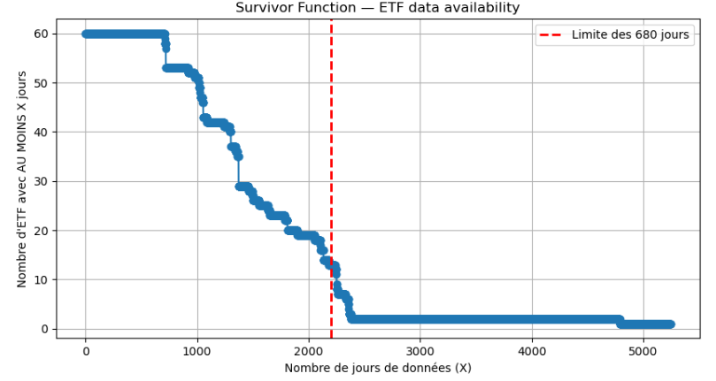

# Volatility and Yield Analysis
* * *
This the part where Data is going to tell us whether in the past years investing in ethical ETF, could also lead to good financial results.
First we need to understand what kind of Data are we working with and it's limitations. 
In this Data set, there are 61 different ETF with the label ESG. Each one of them related to a different Timeframe where Data is available(cf "the data" to see what exactly is in each ETF Data). 
We now Face a major issure, to maximize the quality of our answer, we would like to make an analysis on **as many** different ESG ETF as possible **AND** on the **longest** TimeFrame possible. However, if the analisis is based on a long DataFrame, few ESG ETF will have Data available on this Timeframe. The following graph graph called "the survivor function" shows how many ESG ETF can be analysed as a function of the length of The Timeframe chosen. 

* * *

  <!-- Image 2 : 2/3 -->
  

  <!-- Image 1 : 1/3 -->
  

* * *

We can see on this graph that there is a massiv tradoff between, the TimeFrame and the numer of ESG ETF available. Even for the smartest analyst bros and sisters, it is hard to justify where exactly to choose the number of days threshold to optimize the quality of our analysis. The metodhology that we apllied is the following. We will perform the comparison at first in one point around the middle (1300 days and 41 ESG ETF remaining). This point will then be used to compare the ESG ETF on this DataFrame vs the average of the market, to show how the comparison is performed on one chosen point. Then we will perform the same analysis on many different thresholds to see if there is a commun tendancy of higher or lower performance in terms of yields and volatility.

