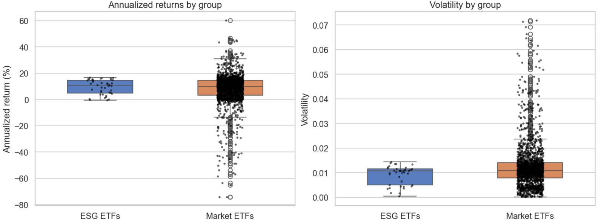

# Volatility and Yield Analysis
* * *
This is the part where data is going to tell us whether, in the past years, investing in ethical ETFs could also lead to good financial results.

Before anything else, we first need to understand what kind of data we are working with and what its limitations are.

In this dataset, there are **61 different ETFs with an ESG label**. Each one has a different timeframe depending on how long data has been available (see the *Data* section for more details about each ETF).

We now face a major issue:  
to maximize the quality of our answer, we would like our analysis to include **as many ESG ETFs as possible** *and* to be performed over the **longest possible timeframe**.  
However, the longer the timeframe, the fewer ESG ETFs actually have data available over that window.

The following graph — the famous *“survivor function”* — shows how many ESG ETFs remain in the analysis depending on the length of the chosen timeframe.

---

  

  

---

We can clearly see on this graph that there is a massive trade-off between the timeframe length and the number of ESG ETFs remaining in the dataset. Even for the smartest analyst bros and sisters, it is hard to justify the “perfect” number of days to choose for an optimal analysis.

The methodology we applied is the following:

Part 1. We first perform the comparison on one “middle-ground” point  
   → **1300 days**, leaving **41 ESG ETFs** in the analysis.  
   This example helps us show how the ESG ETFs are compared to the market as a whole.

Part 2. Then we repeat the exact same analysis across many different thresholds  
    to check whether there is a common tendency toward higher or lower performance in terms of yields and volatility.

This way, instead of relying on a single arbitrary timeframe, we examine whether the results are **stable across multiple horizons**, making our conclusions far more robust.

#Part 1. Performance of ESG ETF vs the market on a middle-ground point:

Lets Dive now in the first poart of our analysis. We selected the middle-ground point in our analysis. For each ETF that has data available in this time frame we perform the folowing calculations :
- The log daily return :
  
$$
r_t = \ln\left(\frac{P_t}{P_{t-1}}\right)
$$

- The We then compute the **average daily log return** for each ETF:
  
$$
\bar{r} = \frac{1}{N} \sum_{t=1}^{N} r_t
$$

Once we know the average daily log return of an ETF, we turn it into an average yearly performance over this Timeframe :

$$
\text{Annualized Return} = e^{252 \cdot \bar{r}} - 1
$$

Log returns and annualized returns are commonly used in finance because they behave much better than simple returns.  
They naturally account for the negative impact of volatility on long-term growth (“volatility drag”) and combine additively over time, making them ideal for multi-period analysis.
For a rigorous explanation of why log returns are preferred in financial modeling, see:  
Hull, *Options, Futures, and Other Derivatives*, Chapter 15 (standard reference in quantitative finance).
If you prefer, I can also link a free online source (MIT, CFA, or an academic paper).

-The volatility of each ETF:

$$
\sigma = \sqrt{\frac{1}{N - 1} \sum_{t = 1}^{N} (r_t - \bar{r})^2}
$$

Volatility measures how much an ETF's returns fluctuate around their average value.  
Mathematically, it is the standard deviation of daily log returns. A higher volatility means the ETF experiences larger day-to-day movements, which corresponds to higher uncertainty and higher risk of rapid losses.

Let's now plot the results correspondingg to this Timeframe : 

And let s compute aswell :

- The average anualized return of each Group :
  
$$
\overline{R}_{\mathrm{ann}} 
= \frac{1}{K} \sum_{i=1}^{K} R_{\mathrm{ann},i}
$$

- The average volatility of each group :

$$
\overline{\sigma} 
= \frac{1}{K} \sum_{i=1}^{K} \sigma_i
$$

These formulas make sense because our goal is to compare the **typical performance of an ESG ETF** with the **typical performance of an ETF in general**.  
In other words, we want to know: *“If I pick one ETF at random from each group, which group performs better on average?”*

To answer this, we simply compute the **average annualized return** and **average volatility** across all ETFs in each group:

- the mean annualized return  
- the mean volatility  

This reflects the performance of an “average ETF” in the group, not the performance of a hypothetical portfolio that invests equally in every ETF.
If we wanted to evaluate such a portfolio, we would need a different mathematical approach (averaging log returns, compounding the combined series, etc.).  
But since our objective is to compare **individual ETF performance**, the simple group mean is better suited.

$$
\begin{array}{c|ccc}
& \textbf{Avg Annualized Return (\%)} 
& \textbf{Avg Daily Volatility} 
& \textbf{Excess vs Market (\%)} \\
\hline
\text{ESG ETFs} 
& 9.45 
& 0.0091 
& 1.14 \\
\text{Market ETFs} 
& 8.31 
& 0.0124 
& 0.00 \\
\end{array}
$$

